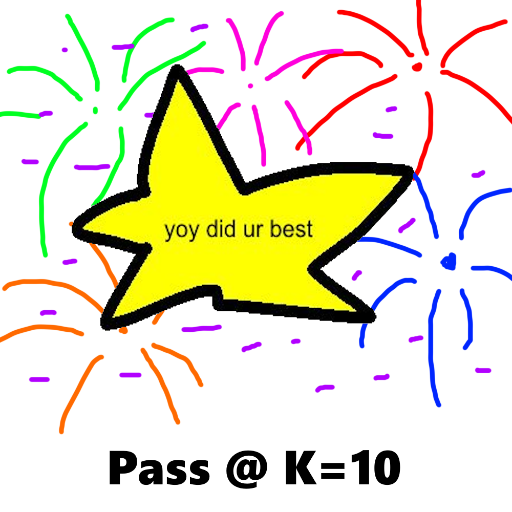
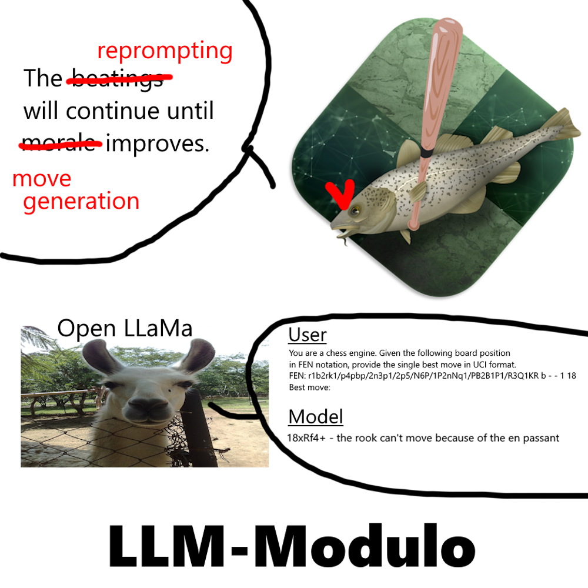

# GAMBIT

**arXiv link COMING SOON**

> <ins>G</ins>ener<ins>a</ins>lization or <ins>M</ins>emorization? <ins>B</ins>r<ins>i</ins>ttleness <ins>T</ins>esting for Chess-Trained Language Models

## TLDR

  
  &nbsp;&nbsp;&nbsp;&nbsp;
  

## Code

### Dependencies

`pip install torch transformers accelerate python-chess numpy sentencepiece protobuf`

You also will need to download the appropiate [Stockfish 18 binary](https://stockfishchess.org/download/) to check for alternate puzzle solutions.

### Model Evaluation on Puzzles (`.\eval_models_on_puzzles`)

`eval_all_models_base.py` - Evaluate all Open LLaMa and ChessGPT on normal and cheating style prompts for the n=300 sample of n=100 mate-in-1, mate-in-2, and mate-in-3 theme puzzles.

`eval_all_models_modulo.py` - Evaluate all Open LLaMa and ChessGPT on pass@K=10 and modulo style prompts for the n=300 sample of n=100 mate-in-1, mate-in-2, and mate-in-3 theme puzzles.

`eval_sf18_variants.py` - Evaluate all SF variants (Base depth=20, Base thinktime=0.05s, Level 0 depth=20) for the n=300 sample of n=100 mate-in-1, mate-in-2, and mate-in-3 theme puzzles.

`puzzle_utils.py` - Contain helper functions sample_puzzles(filepath, n), get_engine(), and check_position_accuracy(response, fen, best_move_uci, best_move_san, engine) used by all other eval files.

> KINGPT puzzle evaluation code is located in its [respective repository](https://github.com/ethanjtang/KINGPT)

### Generate FEN + Best Move Pairs (`.\generate_fen-bestmove_pairs`)

`extract-puzzles.py` - Read puzzles from the Lichess Puzzle Database CSV file into text format, filtering out validation set puzzle positions (at FEN-level) from the training data set for KINGPT-Woodpecker

`sf18-selfplay.py` - Generate N=50 selfplay games between Stockfish 18 Base and Stockfish 18 variants from Levels 0-20. Each side plays 25W and 25B for a total of 1050 selfplay games at depth=15. Converts all unique position + best move pairs played by reasonable players (aka the game ended in a win/draw for the recorded side) to text.

### Results (`.\results`)

`base-model-results.txt` - Results from Open LLaMa and ChessGPT for normal and cheating style prompts on n=300 sample of n=100 mate-in-1, mate-in-2, and mate-in-3 theme puzzles.

`kingpt-results.txt` - Results from KINGPT variants for normal style prompts on (same) n=300 sample of n=100 mate-in-1, mate-in-2, and mate-in-3 theme puzzles.

`modulo-pass@k-results.txt` - Results from Open LLaMa and ChessGPT for pass@K=10 and modulo style prompts on (same) n=300 sample of n=100 mate-in-1, mate-in-2, and mate-in-3 theme puzzles.

`sf-variant-results.txt` - Results from Stockfish 18 variants (Base @ depth=20, Base @ thinktime=0.05s, Level 0 @ depth=20) for normal style prompts on (same) n=300 sample of n=100 mate-in-1, mate-in-2, and mate-in-3 theme puzzles.

`chimera-vs-c1-themes.txt` - Results from theme-wide puzzle comparison (n=100 puzzles for set of m=20 themes for 2000 total puzzles) between KINGPT-Chimera and Z. Tang et. al. 2026's model C1.

### Puzzle Samples (`.\sample_puzzles`)

`mateIn1_sample.txt` - n=100 random sample of mate-in-1 puzzles from validation set of puzzles (please check out Puzzles HF link at top of repo)

`mateIn2_sample.txt` - n=100 random sample of mate-in-2 puzzles from validation set of puzzles 

`mateIn3_sample.txt` - n=100 random sample of mate-in-3 puzzles from validation set of puzzles 

### Misc (`.\misc`)

`.\chessLLM_perf_calc.py` - small script to demonstrate how Zhang et. al. 2025's ChessLLM does not achieve their advertised performance rating of 1788 Elo.

## Training/Inference

Training for KINGPT variants was conducted on a 1x A100 GPU node on the ASU Sol Supercomputer.

Inference for Stockfish 18 and KINGPT variants was conducted on my personal 2019 computer with a Ryzen 7 5800X, 32 GB DDR4 2133 MHz RAM, and GTX 1060 6GB (I would love to upgrade it, but...).

Inference for Open LLaMa 3B and ChessGPT model variants was conducted on a Lambda Labs 1xH100 GPU node.

## Evaluations

### Models Used

| Name | Model |
|:---|:---|
| Stockfish 18 | [Stockfish 18](https://stockfishchess.org/) |
| KINGPT | [KINGPT](https://huggingface.co/ethanjtang/KINGPT) |
| Open LLaMa | [Open LLaMa 3B V1](https://huggingface.co/openlm-research/open_llama_3b) |
| ChessGPT-Base | [ChessGPT Base V1](https://huggingface.co/Waterhorse/chessgpt-base-v1) |
| ChessGPT-Chat | [ChessGPT Chat V1](https://huggingface.co/Waterhorse/chessgpt-chat-v1) |

### Inference Types

For all responses, a seperate judge engine (SF18 instance at depth=20) checks if the provided move is equivalent to the solution provided by Lichess. For mate-in-X puzzles, a move is an alternative solution if it improves the evaluation of the position (mate-in-N -> mate-in-[N-1]).

**normal -** LLM gives a single response

**cheating -** Prompt has the evaluation of the position appended before it, LLM gives a single response

> Please refer to `.\eval_models_on_puzzles\eval_all_models_base` for implementation details on normal and cheating style LLM inference.

**pass@K=10 -** LLM gives 10 responses at temperature=0.7, correct answer if any answer matches solution/passes judgement

**modulo -** LLM is reprompted with feedback up to 10 times from Critic #1 (move validity) or Critic #2 (move accuracy), correct answer if LLM response passes both critics

> Please refer to `.\eval_models_on_puzzles\eval_all_models_modulo` for implementation details on pass@K=10 and modulo style LLM inference.

### Overall Model Accuracy

Overall accuracy = number of correct responses / total number of positions.

A puzzle is considered solved correctly if a model generates a correct response to ALL puzzle positions.

Puzzle accuracy = number of correct responses to puzzles / total number of puzzles

| Model | Inference Type | Puzzle Accuracy | Overall Accuracy |
|:---|:---|---:|---:|
| Stockfish 18, Base | depth=20 | 300/300 (100.0%) | 600/600 (100.0%) |
| Stockfish 18, Base | time=0.05s | 300/300 (100.0%) | 600/600 (100.0%) |
| Stockfish 18, Level 0 | depth=20 | 192/300 (64.0%) | 476/600 (79.3%) |
| KINGPT-Woodpecker | normal | 217/300 (72.3%) | 492/600 (82.0%) |
| KINGPT-Beaver* | normal | 3/300 (1.0%) | 10/600 (1.7%) |
| KINGPT-Chimera | normal | 225/300 (75.0%) | 510/600 (85.0%) |
| Open LLaMa 3B | normal | 0/300 (0.0%) | 1/600 (0.2%) |
| Open LLaMa 3B | cheating | 5/300 (1.7%) | 13/600 (2.2%) |
| Open LLaMa 3B | pass@K=10 | 3/300 (1.0%) | 20/600 (3.3%) |
| Open LLaMa 3B | modulo | 8/300 (2.7%) | 70/600 (11.7%) |
| ChessGPT-Base | normal | 46/300 (15.3%) | 166/600 (27.7%) |
| ChessGPT-Base | cheating | 48/300 (16.0%) | 182/600 (30.3%) |
| ChessGPT-Base | pass@K=10 | 115/300 (38.3%) | 353/600 (58.8%) |
| ChessGPT-Base | Modulo | 54/300 (18.0%) | 202/600 (33.7%) |
| ChessGPT-Chat | normal | 30/300 (10.0%) | 126/600 (21.0%) |
| ChessGPT-Chat | cheating | 37/300 (12.3%) | 153/600 (25.5%) |
| ChessGPT-Chat | pass@K=10 | 61/300 (20.3%) | 227/600 (37.8%) |
| ChessGPT-Chat | modulo | 41/300 (13.7%) | 176/600 (29.3%) |

*KINGPT-Beaver acts as a (approximate) proxy for Zhang et. al. 2025's ChessLLM from ["Complete Chess Games Enable LLM Become Chess Master"](https://arxiv.org/abs/2501.17186v2)

### Overall Model Sanity (Legal Move %)

Sanity measures how frequently a model chooses a legal/valid move in a given position.

Sanity = 1 / (number of invalid parses / total number of positions)

| Model | Inference Type | Sanity |
|:---|:---|---:|
| Stockfish 18 | all | n/a (100%) |
| KINGPT-Woodpecker | normal | 591/600 (98.5%) |
| KINGPT-Beaver | normal | 170/600 (28.3%) |
| KINGPT-Chimera | normal | 597/600 (99.5%) |
| Open LLaMa 3B | normal | 33/600 (5.5%) |
| Open LLaMa 3B | cheating | 120/600 (20.0%) |
| Open LLaMa 3B | pass@K=10 | 309/600 (51.5%) |
| Open LLaMa 3B | modulo | 488/600 (81.3%) |
| ChessGPT-Base | normal | 502/600 (83.7%) |
| ChessGPT-Base | cheating | 486/600 (81.0%) |
| ChessGPT-Base | pass@K=10 | 597/600 (99.5%) |
| ChessGPT-Base | modulo | 590/600 (98.3%) |
| ChessGPT-Chat | normal | 458/600 (76.3%) |
| ChessGPT-Chat | cheating | 398/600 (66.3%) |
| ChessGPT-Chat | pass@K=10 | 569/600 (94.8%) |
| ChessGPT-Chat | modulo | 584/600 (97.3%) |

### [KINGPT](https://github.com/ethanjtang/KINGPT) Theme-wide Comparison vs. [C1](https://github.com/CSSLab/C1)

Note that, **as of 4/28/2026,** the full sample of puzzles has not been published on [Z. Tang's GitHub repo for C1](https://github.com/CSSLab/C1). This is a rough comparison since my sampling method takes the average score across N=100 puzzles without regard for difficulty level.

KINGPT tests for overall accuracy while Z. Tang's model C1 tests for first-move accuracy for puzzles. IMO overall accuracy is a more accurate representation of chess puzzle proficiency (finding the first move of a puzzle is usually easier than the followup*).

**KINGPT -** KINGPT-Chimera
**C1 -** C1-4B

| Theme | KINGPT Accuracy (%) | C1 Accuracy (%) |
|:---|:---|:---|
| advancedPawn | 68.3 | 64 |
| attraction | 76.1 | 64 |
| backRankMate | 96.5 | 84 |
| capturingDefender | 74.4 | 56 |
| defensiveMove | 60.1 | 60 |
**| deflection | 75.9 | 36 |**
| discoveredAttack | 69.7 | 44 |
| doubleCheck | 75.9 | 52 |
**| fork | 71.4 | 36 |**
| hangingPiece | 72.6 | 64 |
| mateIn1 | 87.0 | 64 |
| mateIn2 | 89.0 | 56 |
**| pin | 69.3 | 28 |**
| promotion | 76.1 | 52 |
| queensideAttack | 75.9 | 68 |
| sacrifice | 72.3 | 60 |
| skewer | 78.3 | 52 |
**| trappedPiece | 67.5 | 4 |**
| xRayAttack | 84.6 | 52 |
| zugzwang** | 81.5 | 76 |
**| overall | 75.3 | 53.6 |**

* This is anecdotal from my own experience solving 40k+ rated puzzles on Chess.com
** zugzwang is more commonly referred to colloquially as "zuggie"

## Links

  
  
  
  

## Citation

**Citation COMING SOON**